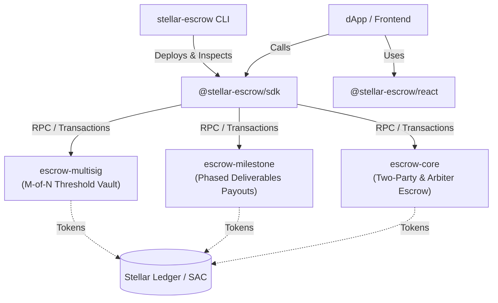

# Stellar Escrow Toolkit 🛡️

[](https://github.com/stellar-escrow-toolkit/stellar-escrow-toolkit/actions/workflows/ci.yml)
[](LICENSE)
[](https://soroban.stellar.org)
[](https://www.typescriptlang.org/)

A modular, auditable Escrow & Milestone Payment framework and TypeScript SDK for the **Stellar & Soroban** ecosystem.

Designed from first principles to replace ad-hoc, fragmented escrow code with reusable, battle-tested smart contracts, typed client SDKs, and headless React components.

---

## 🚀 Why Stellar Escrow Toolkit?

Almost every real-world dApp on Stellar requires conditional settlements:
- **Crowdfunding & Grants**: Funds released upon milestone completion
- **Freelance & Services**: Client deposits, contractor delivers proof, client or arbiter approves
- **Invoice Financing & Trade**: Timelocked settlements with dispute mitigation
- **DAO & Treasury Operations**: M-of-N threshold release approvals

Historically, every Stellar team built their own custom escrow from scratch. **Stellar Escrow Toolkit** unifies these patterns into an open-source, community-governed toolkit that any project can adopt in minutes.

---

## 🏛️ Architecture



---

## 📦 Packages & Crates

| Package / Crate | Type | Description |
|-----------------|------|-------------|
| [`contracts/escrow-core`](./contracts/escrow-core) | Soroban Rust | Base escrow: deposits, timelocks, releases, refunds, disputes & arbiter splits |
| [`contracts/escrow-milestone`](./contracts/escrow-milestone) | Soroban Rust | Milestone-based phased releases with cryptographic proof submissions |
| [`contracts/escrow-multisig`](./contracts/escrow-multisig) | Soroban Rust | M-of-N quorum approval for multi-party escrow arbitration |
| [`@stellar-escrow/sdk`](./packages/sdk) | TypeScript | Typed contract clients, transaction builders, and live event watcher |
| [`@stellar-escrow/react`](./packages/react) | React | Headless hooks (`useEscrow`, `useMilestones`) and UI components (`MilestoneTimeline`, `EscrowCard`) |
| [`stellar-escrow`](./packages/cli) | CLI | Terminal utility to inspect, debug, and interact with escrows on testnet/mainnet |

---

## ⚡ Quickstart

### 1. Using the TypeScript SDK

Install the SDK in your project:

```bash
npm install @stellar-escrow/sdk stellar-sdk
```

```typescript
import { EscrowClient, TESTNET_CONFIG } from '@stellar-escrow/sdk';

// Initialize the escrow client
const client = new EscrowClient(
  'CAAAAAAAAAAAAAAAAAAAAAAAAAAAAAAAAAAAAAAAAAAAAAAAAAAAD2KM',
  TESTNET_CONFIG
);

// 1. Fetch current escrow state
const state = await client.getEscrow();
console.log(`Escrow status: ${state.status}, Amount: ${state.amount}`);

// 2. Generate a deposit operation
const depositOp = client.createDepositOp('G_USER_PUBLIC_KEY');

// 3. Generate a release operation
const releaseOp = client.createReleaseOp('G_INITIATOR_KEY');
```

---

### 2. Using React Hooks & UI Components

```bash
npm install @stellar-escrow/react @stellar-escrow/sdk
```

```tsx
import React from 'react';
import { useEscrow, EscrowCard, useMilestones, MilestoneTimeline } from '@stellar-escrow/react';

export function EscrowViewer({ contractId }: { contractId: string }) {
  const { escrow, isLoading } = useEscrow(contractId);
  const { milestones } = useMilestones(contractId);

  if (isLoading) return <div>Loading escrow...</div>;
  if (!escrow) return <div>Escrow not found</div>;

  return (
    <div>
      <EscrowCard escrow={escrow} />
      <h3>Milestones</h3>
      <MilestoneTimeline milestones={milestones} />
    </div>
  );
}
```

---

### 3. Using the CLI

```bash
# Inspect an escrow state on testnet
npx stellar-escrow inspect -c CABC123... -n testnet

# Inspect all milestones of a contract
npx stellar-escrow inspect-milestones -c CDEF456... -n testnet

# Inspect multisig signers & threshold
npx stellar-escrow inspect-multisig -c CGHI789... -n testnet
```

---

## 🧪 Testing

Run smart contract unit tests:
```bash
make contracts-test
```

Run TypeScript SDK and integration tests:
```bash
npm test
```

---

## 🗺️ Roadmap & Grant Vision (Stellar Community Fund)

- [x] **v0.1**: Core Escrow, Milestone, and Multisig Soroban Contracts
- [x] **v0.1**: TypeScript SDK with Typed Clients & Event Watcher
- [x] **v0.1**: React UI Components & Headless Hooks
- [x] **v0.1**: Inspection CLI tool
- [ ] **v0.2**: Linear & Cliff Vesting Escrow Extension (`escrow-vesting`)
- [ ] **v0.2**: Automated Soroban Contract Deployer CLI command
- [ ] **v0.3**: Freighter & Lobstr Wallet Adapter integrations in `@stellar-escrow/react`
- [ ] **v0.3**: Cross-contract swap integration with Soroswap / Phoenix DEX for auto-conversion on payout

---

## 🤝 Contributing

We welcome community contributions! Check out our [CONTRIBUTING.md](./CONTRIBUTING.md) to get started. Look for issues tagged `good first issue` to make your first commit.

---

## 📄 License

Licensed under the [Apache License, Version 2.0](./LICENSE).
